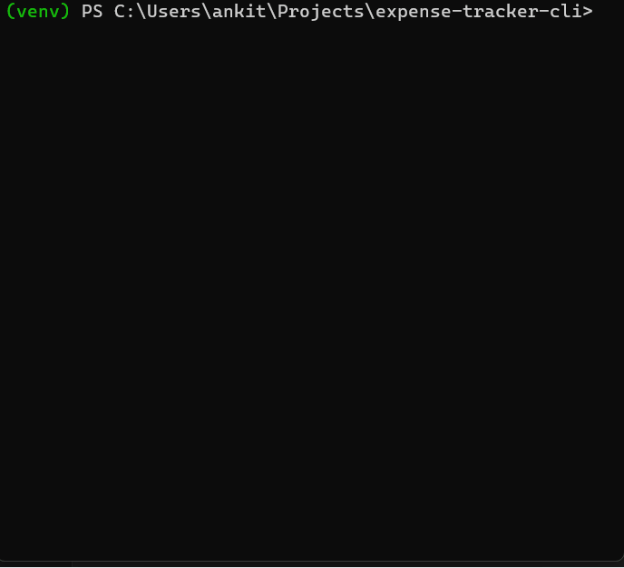

# Expense Tracker CLI

A lightweight command-line tool to load one or more CSV expense files and summarize your spending by month and (optionally) by category.

---

## 📦 Installation

### 1. Clone the repository

```bash
git clone https://github.com/ankitanathula/expense-tracker-cli.git
cd expense-tracker-cli
```

### 2. Set up a virtual environment

A virtual environment keeps project dependencies isolated from your system Python.

```bash
# Create a virtual environment named "venv"
python -m venv venv

# Activate it:

# Windows PowerShell
venv\Scripts\Activate

# macOS/Linux
source venv/bin/activate
```

Your prompt should now start with `(venv)` to show it’s active.

### 3. Install dependencies with pip

`pip` is Python’s package installer. It downloads and installs libraries listed in a requirements file.

```bash
pip install -r requirements.txt
```

`requirements.txt` should include:

```
pandas
tabulate
```

---

## 🚀 Usage

### Running directly with Python

```bash
# Summarize monthly spending
python -m expense_tracker data/jan.csv data/feb.csv

# Add category breakdown
tpython -m expense_tracker data/jan.csv data/feb.csv --by-category
```

### Installing as a standalone command

After you’ve set up the virtual environment and installed in editable mode, you can call `expense-tracker` without `python -m`:

```bash
pip install -e .
expense-tracker data/jan.csv data/feb.csv --by-category
```

This command is exactly the same tool but run as `expense-tracker` instead of `python -m expense_tracker`. You only need `--by-category` if you want the category totals.

---

## 🧰 Core Functions

* **`load_data(file_paths)`**

  * Reads one or more CSV files (must include columns `date`, `amount`, `category`) into a single pandas DataFrame.

* **`summarize(df, by_category=False)`**

  * Returns:

    1. A pandas DataFrame (`monthly_summary`) indexed by month (`pd.Period('M')`) with columns:

       * `sum`  : total spending per month
       * `mean` : average spending per month
    2. A pandas Series (`category_summary`) mapping each category to its total spending (only if `by_category=True`).

* **`main()`**

  * Parses command-line arguments, calls `load_data`, runs `summarize`, and prints results to the console.

---

## 🎥 Demo



---

## 📂 Project Structure

```
expense-tracker-cli/
├── expense_tracker.py    # Core code (load_data, summarize, CLI entry point)
├── test_*.py             # Pytest files for unit and CLI tests
├── requirements.txt      # Project dependencies (pandas)
├── pyproject.toml        # Package metadata and entry-point scripts
└── README.md             # This file
```

---

## 📄 License

MIT © Ankit Anathula